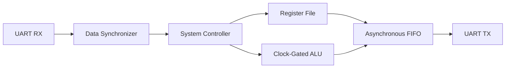

# Low-Power Configurable Multi-Clock Digital System

A UART-controlled multi-clock digital system implemented through an ASIC-oriented flow from RTL design and functional verification to synthesis, DFT, physical implementation, formal equivalence, gate-level simulation, and timing/power signoff.

> **Repository note:** proprietary PDK/standard-cell libraries, EDA internal databases, and other license-controlled technology files are intentionally not included.

## System overview

The system receives commands through UART, executes Register File or ALU operations under a central controller, and returns results through UART TX. Clock-domain crossings are handled using synchronizers and an asynchronous FIFO, while clock gating reduces unnecessary ALU switching.



### Supported commands

| Command | Function |
|---|---|
| `0xAA` | Register File write |
| `0xBB` | Register File read |
| `0xCC` | ALU operation with new operands |
| `0xDD` | ALU operation using stored operands |

## Implementation and verification flow

`RTL -> Functional Verification -> SpyGlass Lint/CDC -> Synthesis -> Formality -> DFT -> Formality -> PnR -> Formality -> GLS + SDF -> PrimeTime / PrimeTime PX`

Tools used during the project included Synopsys Design Compiler, SpyGlass, Formality, PrimeTime/PrimeTime PX, Cadence First Encounter, and QuestaSim.

## Final results

| Check | Result |
|---|---:|
| DFT estimated test coverage | **99.69%** |
| Post-route setup WNS | **+0.255 ns** |
| Post-route hold WNS | **+0.037 ns** |
| Post-route hold violations | **0** |
| Geometry / DRC violations | **0** |
| Connectivity violations | **0** |
| Antenna violations | **0** |
| Post-PnR Formality | **Verification Succeeded** |
| Post-PnR passing compare points | **362** |
| Post-PnR GLS | **TEST PASSED** |
| PrimeTime setup violations | **0** |
| PrimeTime hold violations | **0** |
| Worst PrimeTime setup slack | **+0.25 ns** |
| Worst PrimeTime hold slack | **+0.23 ns** |
| PrimeTime PX total power | **3.478e-04 W** |
| VCD annotation | **100% nets / 100% leaf cells** |

### Hold closure example

After CTS, hold analysis reported a worst slack of **-0.708 ns** with **341 violating paths**. CTS optimization closed the violations to **0**, improving hold WNS to **+0.027 ns** while keeping setup positive. The final post-route result remained positive for both setup and hold.

## Repository structure

```text
.
├── constraints/
│   ├── SYS_TOP_func.sdc
│   ├── SYS_TOP_scan.sdc
│   └── SYS_TOP_capture.sdc
├── dft/                 # DFT-prepared top-level RTL
├── docs/                # Technical project documentation
├── reports/             # Selected project reports
├── rtl/                 # Functional RTL source
├── scripts/
│   ├── synthesis/
│   ├── dft/
│   ├── formality/
│   ├── pnr/
│   ├── primetime/
│   └── spyglass/
├── tb/                  # Functional system-level testbench
├── .gitignore
└── README.md
```

## Documentation

- [`Technical Project Report`](docs/Technical_Project_Report.pdf)
- [`Backend Flow Summary`](docs/Backend_Flow_Summary.pdf)
- [`Functional Test Report`](docs/Functional_Test_Report.pdf)
- [`SpyGlass Lint & CDC Waiver Report`](docs/SpyGlass_Waiver_Report.pdf)

## Scripts and paths

The flow scripts in this repository are the **original scripts used in the project**, kept unchanged. This includes their original relative and absolute paths. They are published as project/reference material rather than as a plug-and-play environment. Anyone re-running the flow should update the paths for their own installation and licensed technology setup.

The repository does not include PDK files, standard-cell libraries, technology LEF/capacitance data, standard-cell simulation models, or EDA internal databases.

## Author

**Mohamed Elsayed Mohamed**  
Electronics & Communications Engineering Student | Digital IC Design
